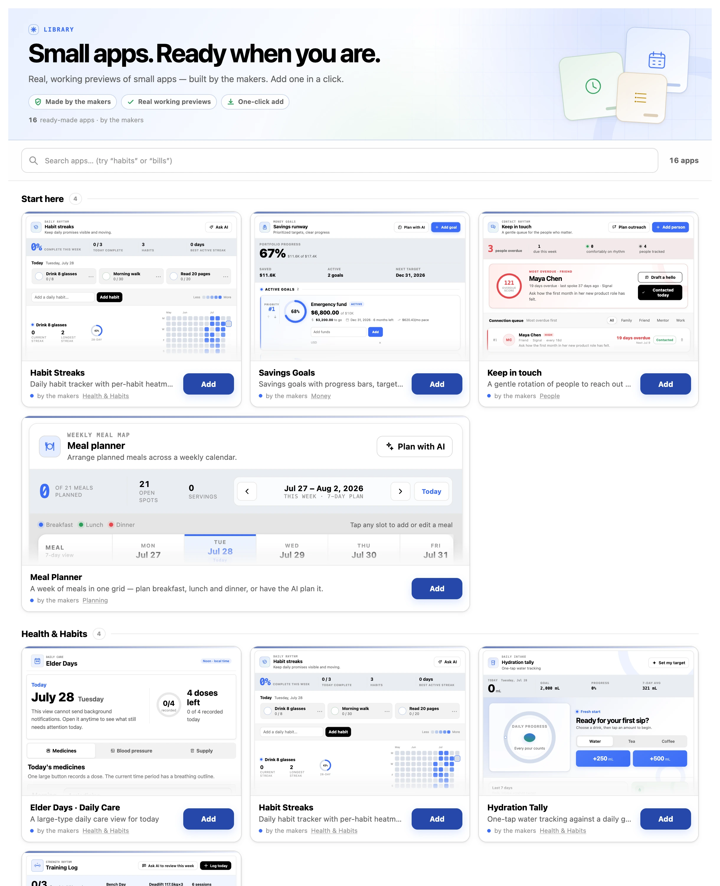

# open-mcp-apps

[English](README.md) | **简体中文**

> 给你的 AI 一个持久、可复用的 UI。它把组件搭一次——你永久拥有。

**open-mcp-apps** 是一个基于 [MCP Apps](https://modelcontextprotocol.io/extensions/apps/overview)
(`ui://`, SEP-1865)构建的开放引擎——MCP Apps 是 Model Context Protocol 的**两个官方 extension**
之一,走协议新设的 Extensions Track。它给任何支持 MCP Apps 的 host(Claude Desktop、claude.ai、
Codex、ChatGPT……)提供 extension 本身不提供的三样东西:

1. **一个 AI 可写入的组件 registry。** 想要一个还不存在的 UI——AI 读一份 authoring guide,针对一个
   极小的 `window.oma` API 写出单文件 HTML 组件并保存。从那一刻起 `open_<name>` 就是一个 tool,在
   这个对话和以后每个对话里都在。
2. **持久、带版本的数据——与 UI 分离。** 组件绑定到通用的 *collections*(item 的集合),背后是 SQLite
   加一条 append-only 的 `change_event` ledger。每次修改都是幂等的 domain command(`command_id`),带
   乐观并发(`expected_version`)。AI 和人编辑同一份 store——widget 只是一个视图。
3. **一个让 AI 写的组件真正能跑的 shell runtime。** 在提供 `ui://` 时,引擎用官方 MCP App bridge、
   host 主题(Claude 的 design tokens,明/暗)、和 `window.oma` 数据 API 把组件包起来。你写的是
   视图;协议、持久化、幂等、主题都是引擎的事。

## The loop(循环)

```
"给我做个 kanban"
      │
      ▼
list_apps ── 已存在? ──► open_kanban          (复用,秒开)
      │ 否
      ▼
get_app_guide ──► AI 写 HTML ──► save_app
      │
      ▼
open_kanban  →  内联渲染、带主题、持久——以后每个对话都能复用
```

组件会不断积累。每个都是单一用途、彼此独立的——一块看板、一个追踪器、一个分账器——为你眼前的任务
铸造,并为你下次需要时留存。

## 长什么样

app 就在你本来那场对话里内联渲染。开口要一个,AI 当场把它写出来:


换一场对话——甚至换一个 host——它还在,数据也还在:


内置 library 自带 17 个现成 app——真实可交互的活预览,一键安装:



| | |
|---|---|
|  |  |
|  |  |

上面每个 app 都是绑定在普通数据集合上的单文件 HTML——用的是你的 AI 将来给你造 app 时
同一套 `window.oma` API 与写作指南。

## 安装

open-mcp-apps 是一个本地 MCP server。先把它**接上**你的 host(见下);之后 **onboarding 在 host 里
单独发生**——那才是 AI 建你第一个 app 的地方。安装需要 shell,所以聊天 app(Claude Desktop、Codex)
自己装不了,用下面之一:

**普通用户——一条命令:**

```bash
curl -fsSL https://raw.githubusercontent.com/2nd1st/open-mcp-apps/main/install.sh | sh
```

它会弹一个简短选择器,让你勾选注册到哪些 host —— **Claude Desktop、Claude Code、Codex** —— 以及权限偏好。
加 `-s -- --yes` 跳过选择器,或 `-s -- --host codex` 只装某个 host。(或自己 clone 后跑:
`git clone https://github.com/2nd1st/open-mcp-apps && cd open-mcp-apps && node install.mjs`。)

> **关于 npm**:npm registry 上的 `open-mcp-apps` 包**不是本项目** —— 那个名字属于一个无关的包。
> 请用上面的命令从本仓库安装。

**用编码 agent**(Claude Code、Codex CLI——它们有 shell),粘:

> Read https://raw.githubusercontent.com/2nd1st/open-mcp-apps/main/install.md and follow it.

两种方式最终都靠 `install.mjs` 把 server 幂等注册进你勾选的每个 host(Claude Desktop、Claude Code、Codex)——
不覆盖其它 server,pin 稳定的 `node` 启动器(原生 SQLite ABI),报告改了什么,并清理 rename 前的旧 entry。你的数据
存在一个**固定的用户级 store**(不在 clone 里),所以每个 host 看到同一份 app 和数据。**装完/更新后,彻底退出
并重开 host**(Cmd-Q,不是关窗)—— 不彻底退出,它会一直挂着连旧数据的旧 server 进程。*remote / 一键安装
(不用 shell)之后再做。*

**卸载:** `node uninstall.mjs` 把 server 从所有检测到的 host 注销——但**保留你的数据**:共享 store
原样留着,以后重装即恢复全部组件和数据。加 `--purge` 连共享 store 一起删(不可逆);加 `--check`
只读预览会发生什么、不做任何改动:

```bash
node uninstall.mjs           # 从所有检测到的 host 注销——数据保留
node uninstall.mjs --purge   # 连共享 store 一起删(组件 + 数据),不可逆
node uninstall.mjs --check   # 只读:看当前注册在哪、将会改什么
```

**重置逃生门:** 整个 store 就是一个 SQLite 文件 `open-mcp-apps.db`,位于
`~/Library/Application Support/open-mcp-apps/`(macOS)、`%APPDATA%\open-mcp-apps\`(Windows)或
`$XDG_DATA_HOME` 否则 `~/.local/share/open-mcp-apps/`(Linux)。彻底退出 host,删掉这个文件
(连同 `-wal`/`-shm` 同伴)即从零开始——组件和数据全部清空、不可逆,安装本身保留。

**然后开始用——在 host 里。** 重启 host。第一次用?对 AI 说一句,比如 **"我刚装了 open-mcp-apps,
给我介绍下怎么用、给几个例子,并建议几个适合我的 app。"** 它会看自己能建什么、翻它对你的了解(记忆 +
历史对话,不够就问你几句),然后为你建一两个贴合的 app。这一步与安装分开、在 host 里。或者直接问:

- *"给我做个板子管我现在手头的事"* → AI 现写、填初始数据、打开(持久)
- *"make me a habit tracker"* → 看它读 guide、写组件、保存、打开
- 关掉 app、重开、再问一次 → 一切都还在

**首次权限:** 头几个 tool call 各弹一次批准框——选 **"Always allow"**。工具集刻意做得小而稳定:只读
tool 一般免批准,而单个 `open_app` tool 覆盖打开*每一个*组件(包括 AI 之后创建的),所以头几次点完
就永久零弹窗。你也可以在 **Settings → Connectors → open-mcp-apps → Tool permissions** 里批量设。注意:
Desktop 自动更新偶尔会重置这些决定(上游
[#56954](https://github.com/anthropics/claude-code/issues/56954))——重新允许即可。一个对话里多个
widget 并存没问题(habit-streaks + meal-planner 并排)。

### 浏览器 viewer,以及它绑的那个端口

每个装机都会在本机跑一个小 web server:**<http://127.0.0.1:8787>**。它是你在聊天窗口之外
*看见*自己 app 的方式——一个 app 一页,读的是跟 AI 同一份数据。在终端宿主里它是**唯一**的
看见方式,所以 AI 建好或打开一个 app 时会把链接给你。

它自己就会起。两种改法:

```bash
OMA_VIEWER=0   # 干脆不起
PORT=9000      # 换个地方起
```

写进你宿主 MCP server 条目的 `env` 块即可。如果端口已经被**另一个 open-mcp-apps 进程**占了,
那个进程本来就在服务同一份数据,这个进程直接共用它的地址;如果被**别的东西**占了,你会得到
「没有 viewer、也没有链接」,而不是一条指向陌生服务器的链接。

**它没有密码,这是刻意的。** listener 写死 `127.0.0.1`,没有任何配置能让它对另一台机器应答。
你电脑上任何能碰到这个端口的程序,本来就能直接打开那个 SQLite 文件——密码是开着的墙旁边加一把锁。
它通向互联网的唯一路径是**你自己开的隧道**,那是另一个深思熟虑的动作;**隧道开着的时候,
把它的 URL 当机密**,因为那目前是互联网和你数据之间唯一的东西。

## 盒子里有什么

| | |
|---|---|
| `src/server.mjs` | stdio MCP server;单一 `open_app` 打开路径(per-app `open_<name>` tool 需 opt-in) |
| `src/http.mjs` | `/mcp`(无状态 Streamable HTTP)+ `/view/<name>` 浏览器 viewer,绑定 `127.0.0.1` |
| `src/store.mjs` | SQLite:item + 组件 registry + `change_event` ledger(幂等,乐观并发) |
| `src/shell-runtime.js` | 注入每个组件的浏览器 runtime(`window.oma`) |
| `src/shell.mjs` | 在提供时用 runtime + design-token 兜底包裹存储的 HTML |
| `src/guide.mjs` | AI 生成组件前读的 authoring 契约 |
| `install-app.mjs` | 安装你自己写的 app(从文件)——唯一一扇不经过 AI 的注册表入口 |
| `components/` | seed 时装 3 个 system 组件(settings、dashboard、library)+ 17 个 library app——不自动安装;在 library app 里浏览、带示例数据实时预览、一键安装 |

```bash
npm test                     # 下面每个 suite,外加静态不变量与预算检查
node test/server-smoke.mjs   # 419 条断言,走真实 stdio——含运行时组件创建
node test/http-smoke.mjs     #  53 条断言,走 HTTP transport(含 SSE /events、viewer)
node test/provenance.mjs     #  39 条断言,验组件 author(信任层)不可被覆写
node test/seed-smoke.mjs     #  14 条断言,验 seed / design-kit 流水线
node test/files-smoke.mjs    #  45 条断言,验 per-app 文件存储(分块上传、GC 竞态)
```

### 自己写一个 app(场外开发)

AI 是通常的作者,但不是唯一的作者——它的 context window 不应该是一个 app 复杂度的天花板。
在你自己的编辑器里写、用你自己的 bundler 构建,然后装进来:

```bash
node install-app.mjs ./my-app.html              # 你写的,完全信任——与 AI 写的同权
node install-app.mjs ./my-app.html --sandboxed  # 不受信:跑在 runner 后面,零 capability
node install-app.mjs --list                     # 装了什么、各自的 provenance
```

一个自包含的 HTML 文档,≤200 KB,不发网络请求——引擎会注入 kit CSS、宿主 design token 和
`window.oma`。交换条件:AI 不再能迭代它(你的文件是唯一真相,改了重装),但仍能读它的源码,
app 也像其它 app 一样共享你的数据。provenance 双向不可覆写:`--sandboxed` 装进来的 app
在删除之前永远在沙盒里。

**[`RUNTIME.md`](RUNTIME.md) 是契约**——两种模式下的 `window.oma` API、沙盒 app 还能做什么,
以及只咬非 AI 作者的那些坑。带版本号,且被测试双向钉住。

## 设计取向(为什么这么建)

- **UI 和数据分开持久,都带版本。** 组件是视图;collections 是真相;ledger 是历史。换掉任一个不丢另一个。
- **AI 只说 domain command,从不碰 SQL、从不碰裸 state。** 这是人 + AI 并发编辑安全的原因(command 层
  的幂等 + 乐观并发)。
- **Extension 优先。** 一切走 MCP Apps 的 bridge——没有 host 私有 API。一套代码应服务每个能渲染
  `ui://` 的 host。
- **单一用途,不做复合。** 每个 app 只占一个场景、绑自己的 collection;引擎宁可新铸一个,也不往旧 app
  里塞功能。system app(settings、dashboard)是刻意的例外——引擎自有、privileged、允许跨 collection 观察。

## 安全模型

信任按组件的来源分层。本地编写的组件和 system 组件跑在 **direct mode**。引擎同时内置一个 **runner**——
一个沙箱化的 `srcdoc` iframe,CSP-first 文档 + 最小只读 bridge——作为任何非本地可信组件的强制执行模式;
另有保留的 `security:*` / `policy:*` 配置 key(通用 data 写入碰不到)和一个 out-of-band 特权写入器。

**诚实的现状:** OSS 版本里的一切——你的 app、AI 建的 app、内置 library 的 app(全部第一方出品)——
都以 direct mode 全信任本地运行;目前还没有任何第三方内容需要沙箱。runner *已建成并测试过,但处于休眠*:
它是将来共享/发布组件的现成接缝——到那时审核与沙箱一起上线。完整威胁模型和信任分层见
[`SECURITY.md`](SECURITY.md)。

## Host 支持(2026-07-22 实测;ChatGPT web 行 2026-07-28 更新)

| Host | 渲染 widget | 人点击 widget | AI 操作数据 | 同一 store |
|---|---|---|---|---|
| **Claude Desktop**(本地 stdio) | ✅ | ✅ 完整循环,含 `sendMessage` 回复 | ✅ | ✅ |
| **浏览器 viewer**(`/view/<name>`) | ✅ | ✅(无 chat 连接——`sendMessage` 降级为提示) | 经 CLI AI | ✅ |
| **Codex desktop**(ChatGPT app,`enable_mcp_apps` flag)—— 对**本地**引擎实测;远程未确立 | ✅ 实验性 | ◐ widget 点击的更新/勾选已通;新增仍被 host 侧拦([openai/codex#28912](https://github.com/openai/codex/issues/28912),见 KNOWN-ISSUES) | ✅ | ✅ |
| **Claude Code**(CLI,`claude mcp`) | —(设计上走文本 fallback) | — | ✅ | ✅ |
| **codex CLI / IDE** | —(设计上走文本 fallback) | — | ✅ | ✅ |
| **ChatGPT web**(Work mode) | ✅ 2026-07-28 实测(远程 HTTPS)——满高渲染,未被截断 | ✅ widget 按钮新增一条,落盘成功 | ✅ | ✅ |

一切走 MCP Apps 的 bridge,所以上游 host 的修复(如 #28912)不改一行也能让本项目受益。

**关于 Codex:** plugin 是从 web 侧注册的,所以**本地安装的引擎以 MCP server 的形式接入**,
而不是作为 plugin —— 对自托管来说这本来也是对的那条路。ChatGPT 桌面 app 里的 widget 渲染
似乎还与登录方式有关(我们见过账号登录下可用;API key 下尚未确立)。

## 状态 / 路线图

早期 v0——在 Claude Desktop 端到端验证;跨厂商渲染 + 共享 store 在 Codex desktop 和浏览器 viewer 上
验证。

- [x] 引擎:registry + shell + 通用 data command + ledger
- [x] 只装 system 组件(settings、dashboard、library);17 个 library app 可在 library 里浏览预览、一键安装
- [x] AI 组件创建循环(guide → save → 动态 tool)
- [x] in-context onboarding(问怎么用 → AI 翻你的历史/记忆,建一组贴合你的起手 app)
- [x] 安全地基:信任分层 + 沙箱 runner + 保留配置 key
- [x] 多 host 发现式安装器(Claude Desktop · Claude Code · Codex)+ 共享的用户级 store
- [ ] `npx` 一条命令安装
- [ ] 远程(Streamable HTTP)模式 → claude.ai / ChatGPT / 移动端
- [ ] 组件 export/import → 分享 → 社区库

## 许可

按目录分成**两个许可**([`LICENSING.md`](LICENSING.md) 有完整对照表):

- **引擎** —— `components/` 以外的一切 —— 是 **AGPL-3.0-only**([`LICENSE`](LICENSE))。
  把改过的版本作为网络服务运行,就必须向使用者提供你修改版的源码(AGPL §13);
  对引擎的改进因此始终保持开放。
- **官方组件** —— [`components/`](components/) 里你运行和编辑的那些 app —— 是 **MIT**
  ([`components/LICENSE`](components/LICENSE))。任何 app 都可自由打开、复制、fork、
  再分发;改你自己的 dashboard 永远不该是个法律问题。

名称 **open-mcp-apps**、**openmcp.app**、**SecondFirst**、**2nd1st** 及其 logo
**不**在任何一个许可的授予范围内 —— 见 [`TRADEMARKS.md`](TRADEMARKS.md)。代码尽管 fork,
但请给你的 fork 起自己的名字。

组件的贡献不需要签任何东西 —— MIT 进 MIT 出。引擎的贡献请先开 issue:
CLA 是计划中的,但目前仍是草稿
([`CONTRIBUTING.md`](CONTRIBUTING.md) · [`CLA.md`](CLA.md))。

© 2026 [2nd1st](https://github.com/2nd1st)
