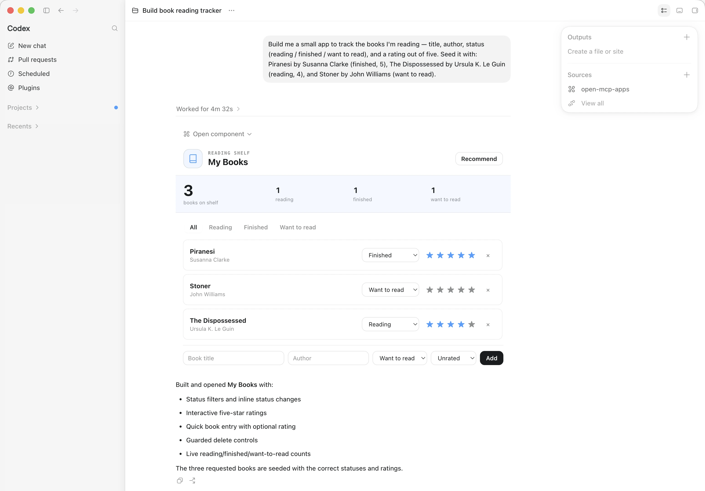
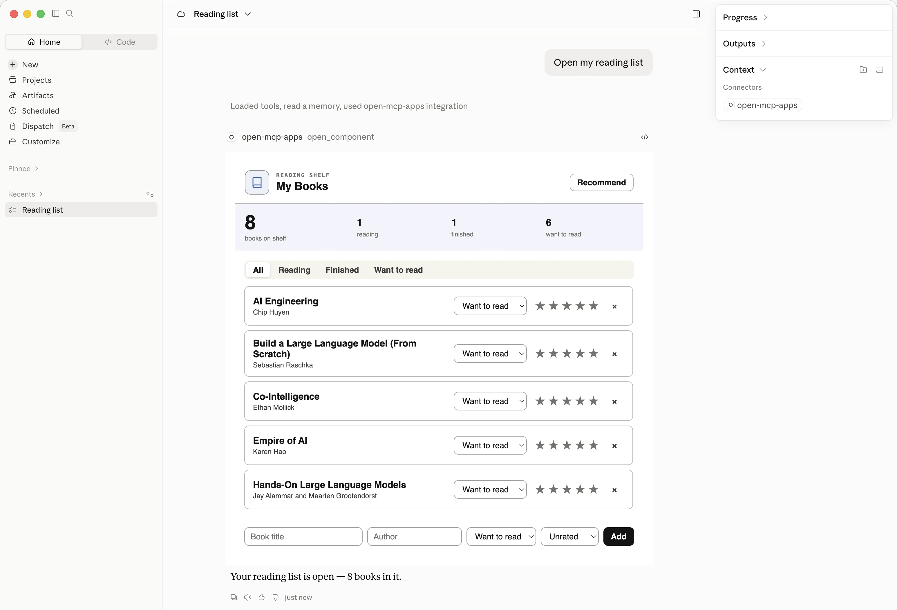
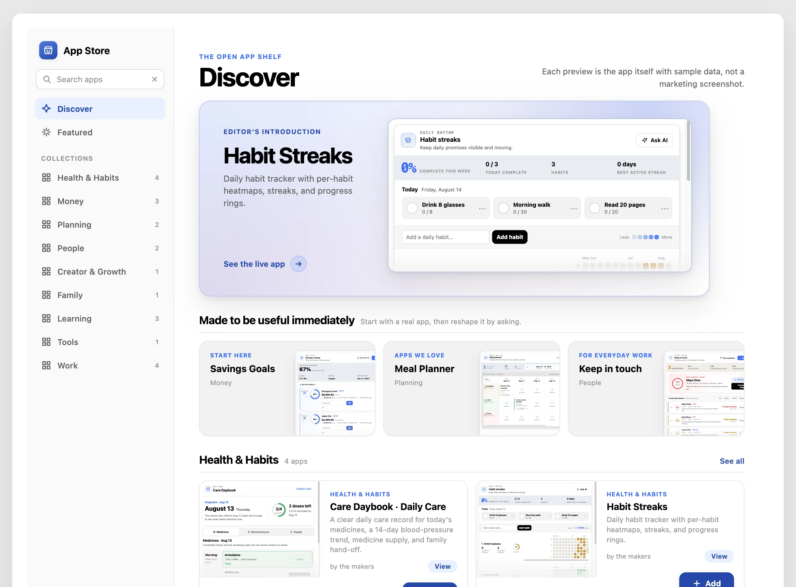
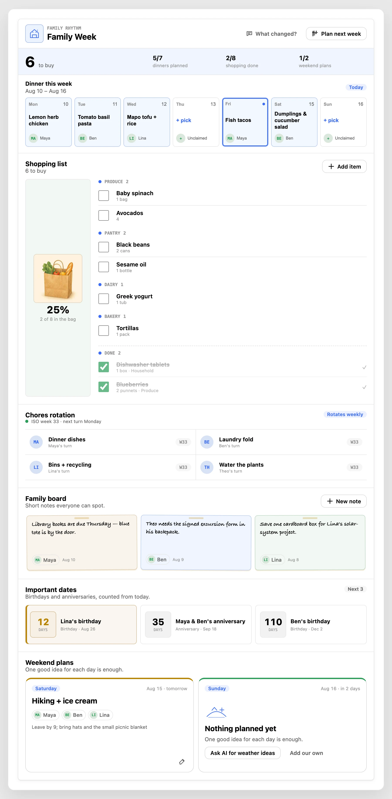
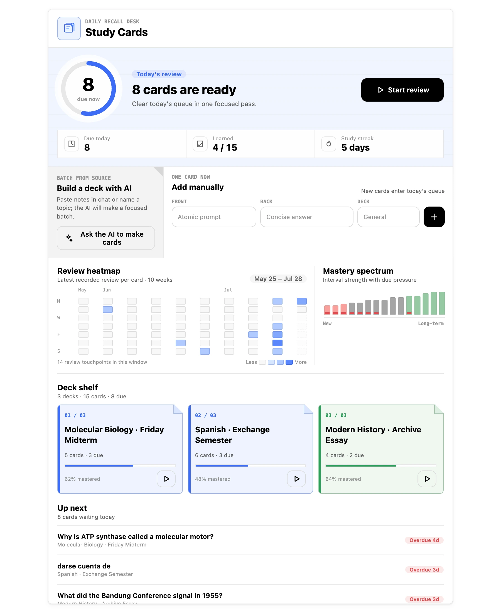

# open-mcp-apps

[](https://www.npmjs.com/package/@2nd1st/open-mcp-apps)
[](LICENSE)
[](package.json)
[](https://registry.modelcontextprotocol.io/v0/servers?search=open-mcp-apps)

[English](README.md) | **简体中文**

> 给你的 AI 一个持久、可复用的 UI。它把 app 搭一次——你永久拥有。

**open-mcp-apps** 是一个基于 [MCP Apps](https://modelcontextprotocol.io/extensions/apps/overview)
(`ui://`, `io.modelcontextprotocol/ui`)构建的开放引擎——MCP Apps 是 core MCP 规范之外的 extension,
也是**第一个官方 extension**,2026 年 1 月 GA。它给任何支持 MCP Apps 的 host(Claude Desktop、
claude.ai、Codex、ChatGPT……)提供 extension 本身不提供的三样东西:

1. **一个 AI 可写入的 app registry。** 想要一个还不存在的 UI——AI 读一份 authoring guide,针对一个
   极小的 `window.oma` API 写出单文件 HTML app 并保存。从那一刻起你随时能按名字打开它,在
   这个对话和以后每个对话里都在。
2. **持久、带版本的数据——与 UI 分离。** app 绑定到通用的 *collections*(item 的集合),背后是 SQLite
   加一条 append-only 的 `change_event` ledger。每次修改都是幂等的 domain command(`command_id`),带
   乐观并发(`expected_version`)。AI 和人编辑同一份 store——widget 只是一个视图。
3. **一个让 AI 写的 app 真正能跑的 shell runtime。** 在提供 `ui://` 时,引擎用官方 MCP App bridge、
   host 主题(Claude 的 design tokens,明/暗)、和 `window.oma` 数据 API 把 app 包起来。你写的是
   视图;协议、持久化、幂等、主题都是引擎的事。

| | |
|---|---|
| **版本** | 0.5.6([`CHANGELOG.md`](CHANGELOG.md)) |
| **许可** | 全仓 MIT([`LICENSE`](LICENSE) · [`LICENSING.md`](LICENSING.md)) |
| **npm** | `@2nd1st/open-mcp-apps` —— **带 scope**;不带 scope 的同名包与本项目无关 |
| **怎么跑** | `npx -y @2nd1st/open-mcp-apps`(stdio MCP server) |
| **前置** | Node 22 或更新。走安装器还需要 `git` |
| **规模** | 33 个 tool · 一个内置 App Store · 三个随 seed 装好的系统 app |
| **平台** | macOS · Windows · Linux |
| **宿主** | Claude Desktop · Claude Code · Codex · ChatGPT web —— 见 [Host 支持](#host-支持) |
| **托管版** | [openmcp.app](https://openmcp.app) |

## 安装

open-mcp-apps 是一个本地 MCP server。先把它**接上**你的 host(见下);之后 **onboarding 在 host 里
单独发生**——那才是 AI 建你第一个 app 的地方。

### 从 npm 装——不用 clone

如果你不介意自己改 host 的配置文件,直接把它指向已发布的包,让 `npx` 去取引擎。这条路只需要
Node 22 —— 不需要 `git`,也不留一个要你自己维护的 checkout。把这段贴进你 host 的 MCP server 配置:

```json
{
  "mcpServers": {
    "open-mcp-apps": {
      "command": "npx",
      "args": ["-y", "@2nd1st/open-mcp-apps"]
    }
  }
}
```

安装器多做两件这条路不做的事:把 server 注册进它找到的每个 host,以及把内置的系统 app
(settings、dashboard、App Store)预先 seed 进你的 store —— 所以走 `npx` 这条路时你的 registry
是空的,由 AI 按需从 App Store 装它要的东西,而 App Store 本身两条路都是全的。两条路的数据都落在
同一个固定的用户级 store,所以你在 `npx` 版和 clone 版之间来回切,不需要迁移任何东西。

> **关于 npm**:本项目发布在**带 scope 的**名字
> [`@2nd1st/open-mcp-apps`](https://www.npmjs.com/package/@2nd1st/open-mcp-apps) 下。npm registry 上
> **不带 scope 的** `open-mcp-apps` **不是本项目** —— 那个名字属于一个无关的包。认准 `@2nd1st/`
> 前缀,区分两者的只有这个 scope。

### 用安装器——一条命令

安装需要 shell,所以聊天 app(Claude Desktop、Codex)自己装不了,用下面这条:

```bash
curl -fsSL https://raw.githubusercontent.com/2nd1st/open-mcp-apps/main/install.sh | sh
```

它会弹一个简短选择器,让你勾选注册到哪些 host —— **Claude Desktop、Claude Code、Codex** —— 以及
权限偏好。加 `-s -- --yes` 跳过选择器,或 `-s -- --host codex` 只装某个 host。

**用编码 agent**(Claude Code、Codex CLI——它们有 shell),粘:

> Read https://raw.githubusercontent.com/2nd1st/open-mcp-apps/main/install.md and follow it.

两种方式最终都靠 `install.mjs` 把 server 幂等注册进你勾选的每个 host —— 不覆盖其它 server,
pin 稳定的 `node` 启动器(原生 SQLite ABI),报告改了什么,并清理 rename 前的旧 entry。你的数据
存在一个**固定的用户级 store**(不在 clone 里),所以每个 host 看到同一份 app 和数据。

### 从 clone 装——开发用

```bash
git clone https://github.com/2nd1st/open-mcp-apps && cd open-mcp-apps
npm install
node install.mjs        # 与上面那条一键命令同一个选择器
```

想手工把一个 checkout 接进 host,就指向这个 checkout —— 下面正是 `install.mjs` 写进去的形状:

```json
{
  "mcpServers": {
    "open-mcp-apps": {
      "command": "node",
      "args": ["/absolute/path/to/open-mcp-apps/src/server.mjs"]
    }
  }
}
```

### 托管版

[openmcp.app](https://openmcp.app) 替你跑这个引擎。本仓的引擎按设计绑死 `127.0.0.1`,所以自建的
远程部署目前还不是一种受支持的形态 —— 见[状态与路线图](#状态与路线图)。

### 卸载

`node uninstall.mjs` 把 server 从所有检测到的 host 注销——但**保留你的数据**:共享 store
原样留着,以后重装即恢复全部 app 和数据。

```bash
node uninstall.mjs           # 从所有检测到的 host 注销——数据保留
node uninstall.mjs --purge   # 连共享 store 一起删(app + 数据),不可逆
node uninstall.mjs --check   # 只读:看当前注册在哪、将会改什么
```

## 前置要求

- **Node 22 或更新**,macOS / Windows / Linux 均可。
- **`git`** —— 只有走安装器那条路才需要。上面的 `npx` 路径既不需要 `git` 也不需要 checkout。
  安装器这两样都会检查,缺哪个就报错停下,而不是装到一半。
- **一个能渲染 `ui://` 的 host**,如果你要的是 widget 而不是文本。终端宿主(Claude Code、codex CLI)
  按设计操作同一份数据,并在浏览器 viewer 里看它。逐个宿主的实测见 [Host 支持](#host-支持)。
- **装完/更新后,彻底退出并重开 host**(Cmd-Q,不是关窗)—— 不彻底退出,它会一直挂着连旧数据的
  旧 server 进程。

## 配置

每一项都是环境变量,写进你宿主 MCP server 条目的 `env` 块:

```json
{
  "mcpServers": {
    "open-mcp-apps": {
      "command": "npx",
      "args": ["-y", "@2nd1st/open-mcp-apps"],
      "env": {
        "OMA_VIEWER": "1",
        "PORT": "8787",
        "OMA_DYNAMIC_TOOLS": "0"
      }
    }
  }
}
```

| 变量 | 默认 | 作用 |
|---|---|---|
| `OMA_VIEWER` | `1` | loopback 上的浏览器 viewer。设 `0` 则干脆不起。 |
| `PORT` | `8787` | viewer 监听在哪。 |
| `OMA_DYNAMIC_TOOLS` | `0` | 设 `1` 则每个已保存的 app 另有一个 `open_<name>` tool。默认关,因为它吃 prompt cache —— 且每个 app 各花一次授权提示。 |
| `OMA_DB` | 用户级 store | SQLite store 的路径。想隔离一份 store 就设它。 |

**你的数据在哪。** 整个 store 就是一个 SQLite 文件 `open-mcp-apps.db`,位于
`~/Library/Application Support/open-mcp-apps/`(macOS)、`%APPDATA%\open-mcp-apps\`(Windows)或
`$XDG_DATA_HOME` 否则 `~/.local/share/open-mcp-apps/`(Linux)。它在任何 clone 之外,这正是每个
host 共享同一份 app 和数据的原因。

**首次权限。** 头几个 tool call 各弹一次批准框——选 **"Always allow"**。工具集刻意做得小而稳定:只读
tool 一般免批准,而默认情况下单个 `open_app` tool 就覆盖打开*每一个* app(包括 AI 之后创建的),
一次授权全包,之后不会再有新东西来问你。**Claude Desktop 和 Claude Code 这两个宿主是例外**:
安装器给它们写了 `OMA_DYNAMIC_TOOLS=1`,于是每个 app 各有一个自己的 `open_<name>` tool——代价是
每个 app 各花一次授权提示。那是针对这两个宿主聊天面 bridge 回归的**临时**绕行(`install.mjs` 里
自标 TEMPORARY,[`KNOWN-ISSUES.md`](KNOWN-ISSUES.md) 有整条),宿主修好就撤掉。你也可以在
**Settings → Connectors → open-mcp-apps → Tool permissions** 里批量设。

## 怎么用

**从你的 host 开始。** 装完先重启它。第一次用?对 AI 说一句,比如 **"我刚装了 open-mcp-apps,
给我介绍下怎么用、给几个例子,并建议几个适合我的 app。"** 它会看自己能建什么、翻它对你的了解(记忆 +
历史对话,不够就问你几句),然后为你建一两个贴合的 app。这一步与安装分开、在 host 里。或者直接问:

- *"给我做个板子管我现在手头的事"* → AI 现写、填初始数据、打开(持久)
- *"make me a habit tracker"* → 看它读 guide、写 app、保存、打开
- 关掉 app、重开、再问一次 → 一切都还在

### 循环

```
"给我做个 kanban"
      │
      ▼
list_apps ── 已存在? ──► open_kanban          (复用,秒开)
      │ 否
      ▼
get_app_guide ──► AI 写 HTML ──► save_app
      │
      ▼
open_kanban  →  内联渲染、带主题、持久——以后每个对话都能复用
```

app 会不断积累。每个都是单一用途、彼此独立的——一块看板、一个追踪器、一个分账器——为你眼前的任务
铸造,并为你下次需要时留存。

### 长什么样

app 就在你本来那场对话里内联渲染。开口要一个,AI 当场把它写出来:



换一场对话——甚至换一个 host——它还在,数据也还在:



内置 App Store——在 0.5.0 重建成了一个真正的店面——自带 22 个现成 app,带真实可交互的活预览,
一键安装:



| | |
|---|---|
|  |  |
|  |  |

上面每个 app 都是绑定在普通数据集合上的单文件 HTML——用的是你的 AI 将来给你造 app 时
同一套 `window.oma` API 与写作指南。

一个对话里多个 widget 并存没问题(habit-streaks + meal-planner 并排)。

### 浏览器 viewer,以及它绑的那个端口

每个装机都会在本机跑一个小 web server:**<http://127.0.0.1:8787>**。它是你在聊天窗口之外
*看见*自己 app 的方式——一个 app 一页,读的是跟 AI 同一份数据。在终端宿主里它是**唯一**的
看见方式,所以 AI 建好或打开一个 app 时会把链接给你。

它自己就会起;上面的 `OMA_VIEWER` 和 `PORT` 用来改这件事。如果端口已经被**另一个 open-mcp-apps
进程**占了,那个进程本来就在服务同一份数据,这个进程直接共用它的地址;如果被**别的东西**占了,
你会得到「没有 viewer、也没有链接」,而不是一条指向陌生服务器的链接。

**它没有密码,这是刻意的。** listener 写死 `127.0.0.1`,没有任何配置能让它对另一台机器应答。
你电脑上任何能碰到这个端口的程序,本来就能直接打开那个 SQLite 文件——密码是开着的墙旁边加一把锁。
它通向互联网的唯一路径是**你自己开的隧道**,那是另一个深思熟虑的动作;**隧道开着的时候,
把它的 URL 当机密**,因为那目前是互联网和你数据之间唯一的东西。

## Host 支持

2026-07-22 实测;ChatGPT web 行 2026-07-28 更新。

| Host | 渲染 widget | 人点击 widget | AI 操作数据 | 同一 store |
|---|---|---|---|---|
| **Claude Desktop**(本地 stdio) | ✅ | ✅ 完整循环,含 `sendMessage` 回复 | ✅ | ✅ |
| **浏览器 viewer**(`/view/<name>`) | ✅ | ✅(无 chat 连接——`sendMessage` 降级为提示) | 经 CLI AI | ✅ |
| **Codex desktop**(ChatGPT app,`enable_mcp_apps` flag)—— 对**本地**引擎实测;远程未确立 | ✅ 实验性 | ◐ widget 点击的更新/勾选已通;新增仍被 host 侧拦([openai/codex#28912](https://github.com/openai/codex/issues/28912),见 KNOWN-ISSUES) | ✅ | ✅ |
| **Claude Code**(CLI,`claude mcp`) | —(设计上走文本 fallback) | — | ✅ | ✅ |
| **codex CLI / IDE** | —(设计上走文本 fallback) | — | ✅ | ✅ |
| **ChatGPT web**(Work mode) | ✅ 2026-07-28 实测(远程 HTTPS)——满高渲染,未被截断;页面刷新后 widget 会丢数据(缓解已 ship,但尚未在这个宿主上复测——见 KNOWN-ISSUES) | ✅ widget 按钮新增一条,落盘成功 | ✅ | ✅ |

一切走 MCP Apps 的 bridge,所以上游 host 的修复(如 #28912)不改一行也能让本项目受益。

**关于 Codex:** plugin 是从 web 侧注册的,所以**本地安装的引擎以 MCP server 的形式接入**,
而不是作为 plugin —— 对自托管来说这本来也是对的那条路。ChatGPT 桌面 app 里的 widget 渲染
似乎还与登录方式有关(我们见过账号登录下可用;API key 下尚未确立)。

## 自己写一个 app(场外开发)

AI 是通常的作者,但不是唯一的作者——它的 context window 不应该是一个 app 复杂度的天花板。
在你自己的编辑器里写、用你自己的 bundler 构建,然后装进来:

```bash
node install-app.mjs ./my-app.html              # 你写的,完全信任——与 AI 写的同权
node install-app.mjs ./my-app.html --sandboxed  # 不受信:跑在 runner 后面,零 capability
node install-app.mjs --list                     # 装了什么、各自的 provenance
```

一个自包含的 HTML 文档,≤200 KB,不发网络请求——引擎会注入 kit CSS、宿主 design token 和
`window.oma`。交换条件:AI 不再能迭代它(你的文件是唯一真相,改了重装),但仍能读它的源码,
app 也像其它 app 一样共享你的数据。provenance 双向不可覆写:`--sandboxed` 装进来的 app
在删除之前永远在沙盒里。

**[`RUNTIME.md`](RUNTIME.md) 是契约**——两种模式下的 `window.oma` API、沙盒 app 还能做什么,
以及只咬非 AI 作者的那些坑。它带一个版本号(`oma.contract`),`test/runtime-contract.mjs` 把它钉在
两个 runtime 的真实表面上,所以它不会悄悄跟它们漂开。

## 安全模型

信任按 app 的来源分层。本地编写的 app 和 system app 跑在 **direct mode**。引擎同时内置一个 **runner**——
一个沙箱化的 `srcdoc` iframe,CSP-first 文档 + 最小只读 bridge——作为任何非本地可信 app 的强制执行模式;
另有保留的 `security:*` / `policy:*` 配置 key(通用 data 写入碰不到)和一个 out-of-band 特权写入器。

**诚实的现状:** OSS 版本里的一切——你的 app、AI 建的 app、内置 App Store 的 app(全部第一方出品)——
都以 direct mode 全信任本地运行;目前还没有任何第三方内容需要沙箱。runner *已建成并测试过,但处于休眠*:
它是将来共享/发布 app 的现成接缝——到那时审核与沙箱一起上线。完整威胁模型和信任分层见
[`SECURITY.md`](SECURITY.md)。

## 设计取向(为什么这么建)

- **UI 和数据分开持久,都带版本。** app 是视图;collections 是真相;ledger 是历史。换掉任一个不丢另一个。
- **AI 只说 domain command,从不碰 SQL、从不碰裸 state。** 这是人 + AI 并发编辑安全的原因(command 层
  的幂等 + 乐观并发)。
- **Extension 优先。** 一切走 MCP Apps 的 bridge——没有 host 私有 API。一套代码应服务每个能渲染
  `ui://` 的 host。
- **单一用途,不做复合。** 每个 app 只占一个场景、绑自己的 collection;引擎宁可新铸一个,也不往旧 app
  里塞功能。system app(settings、dashboard)是刻意的例外——引擎自有、privileged、允许跨 collection 观察。

## 排障

| 症状 | 是什么 |
|---|---|
| 更新了,但宿主行为还是旧的 | 宿主不**彻底退出**(Cmd-Q,不是关窗)就会一直挂着连旧数据的旧 server 进程。 |
| `pnpm install` 以 1 退出，报 `ERR_PNPM_IGNORED_BUILDS` | pnpm 11 在你表态之前不跑第三方构建脚本，并把这件事算作错误。这里没有东西需要构建 —— `better-sqlite3` 加载它自带的预编译产物，esbuild 的二进制来自它的平台包 —— 所以它留下的这棵树是完整可用的。`pnpm approve-builds` 随你怎么答，或者用 npm。我们不去声明「允许这些脚本」：那会让 pnpm 在没有工具链的机器上（容器、多数 CI）真的去编译 `better-sqlite3`，白白失败。 |
| Claude Desktop 自动更新后又开始弹批准框 | Desktop 自动更新偶尔会重置这些决定(上游 [#56954](https://github.com/anthropics/claude-code/issues/56954))——重新允许即可。 |
| 每个 app 各弹一次授权 | `OMA_DYNAMIC_TOOLS=1`,安装器给 Claude Desktop 和 Claude Code 写了它。见[配置](#配置)。 |
| 没有 viewer 链接,或 viewer 是别人的 | 端口被一个非 open-mcp-apps 的进程占了。把 `PORT` 换成空闲的。 |
| ChatGPT web 上刷新页面后 widget 丢数据 | 已知,缓解已 ship,实测复验待做——[`KNOWN-ISSUES.md`](KNOWN-ISSUES.md)。 |
| Codex desktop 上 widget 能改不能加 | 被宿主侧拦住,[openai/codex#28912](https://github.com/openai/codex/issues/28912)。 |
| 想彻底从零开始 | 彻底退出宿主,删掉[配置](#配置)那节所说 store 目录下的 `open-mcp-apps.db`(连同 `-wal`/`-shm` 同伴)。app 和数据全部清空、不可逆,安装本身保留。 |

## 开发

| | |
|---|---|
| `src/server.mjs` | stdio MCP server;单一 `open_app` 打开路径(per-app `open_<name>` tool 默认关,`OMA_DYNAMIC_TOOLS=1` 才开) |
| `src/http.mjs` | `/mcp`(无状态 Streamable HTTP)+ `/view/<name>` 浏览器 viewer,绑定 `127.0.0.1` |
| `src/store.mjs` | SQLite:item + app registry + `change_event` ledger(幂等,乐观并发) |
| `src/shell-runtime.js` | 注入每个 app 的浏览器 runtime(`window.oma`) |
| `src/shell.mjs` | 在提供时用 runtime + design-token 兜底包裹存储的 HTML |
| `src/guide.mjs` | AI 生成 app 前读的 authoring 契约 |
| `install-app.mjs` | 安装你自己写的 app(从文件)——唯一一扇不经过 AI 的注册表入口 |
| `components/` | seed 时装 3 个 system app(settings、dashboard、app-store)+ 22 个 App Store app——不自动安装;在 app-store app 里浏览、带示例数据实时预览、一键安装 |

```bash
npm test                     # 下面每个 suite,外加静态不变量与预算检查
node test/server-smoke.mjs   # 427 条断言,走真实 stdio——含运行时 app 创建
node test/http-smoke.mjs     #  79 条断言,走 HTTP transport(含 SSE /events、viewer)
node test/provenance.mjs     #  39 条断言,验 app 的 author(信任层)不可被覆写
node test/seed-smoke.mjs     #  22 条断言,验 seed / design-kit 流水线
node test/files-smoke.mjs    #  41 条断言,验 per-app 文件存储(分块上传、GC 竞态)
```

贡献无需签署任何协议 —— MIT 进,MIT 出([`CONTRIBUTING.md`](CONTRIBUTING.md))。

## 状态与路线图

早期 v0——在 Claude Desktop 端到端验证;跨厂商渲染 + 共享 store 在 Codex desktop 和浏览器 viewer 上
验证。

**0.5.0 改了什么**(breaking,也是迄今最大的一次改动——完整交代见
[`CHANGELOG.md`](CHANGELOG.md)):

- **app 的 declaration 成了一等对象。** `save_app` 收 `ui` 和 `manifest` 两个槽,而不再是埋在文档里的
  一段 manifest 块;每次修订两个槽一起快照,所以 restore 拿回来的是一对,不是单份文档。
- **app 可以对外暴露 function**——一个 data→data 的闭包,AI 用 `call_function` 调,由引擎在这个 app
  自己的 collection 上执行。这个席位在 `createEngine` 处 opt-in、缺省不给,所以托管部署没法从构造上
  继承到它。
- **删一行由引擎确认**,确认点在每条路径都必经的那个 store 事务里。app 作者不必再自己写确认 UI——
  原来自带「点一次待命、再点才删」的那些 app,这段都被摘掉了。
- **`promote_app`** 一步把一次性的 `visual` 原地升成常驻的 app;**`edit_app` 收带哈希校验的
  `{offset, length}` 区间**,读过一个窗口的模型可以直接改它,不用再把锚点字符串传回来。
- **Settings 与 App Store 整体重建**——左栏导航、原地详情页,以及上面那张图里的店面。
- 底下换了地基:**SDK v1 → v2**、支持的协议版本里加进 `2026-07-28`、工具面审计到 **33 个 tool**。
  改名和删掉的 tool 意味着升级后宿主会再要你批准一次工具。

现状:

- [x] 引擎:registry + shell + 通用 data command + ledger
- [x] 只装 system app(settings、dashboard、app-store);22 个 App Store app 可在 app-store 里浏览预览、一键安装
- [x] AI 建 app 的循环(guide → save → 打开)
- [x] in-context onboarding(问怎么用 → AI 翻你的历史/记忆,建一组贴合你的起手 app)
- [x] 安全地基:信任分层 + 沙箱 runner + 保留配置 key
- [x] 多 host 发现式安装器(Claude Desktop · Claude Code · Codex)+ 共享的用户级 store
- [x] `npx` 一条命令安装(npm 上的 `@2nd1st/open-mcp-apps`)
- [ ] 远程(Streamable HTTP)作为一种*受支持*的形态 → claude.ai / ChatGPT / 移动端——transport
      本身已经在(`src/http.mjs`),也在 HTTPS 上实测过;缺的是托管那一半,因为引擎按设计绑死
      `127.0.0.1`
- [ ] 不用 shell 的一键安装
- [ ] app export/import → 分享 → 社区 App Store

## 许可

全仓**统一 MIT** —— 引擎和 [`components/`](components/) 里的 app 一视同仁
([`LICENSE`](LICENSE) · [`LICENSING.md`](LICENSING.md))。随便用、fork、改、嵌入、
把改过的版本作为托管服务跑;再分发实质部分时保留版权声明即可 —— 义务只有这一条。
v0.5.2 之前引擎是 AGPL-3.0-only、按目录分成两个许可,改动的来龙去脉见
[`LICENSING.md`](LICENSING.md)。

名称 **open-mcp-apps**、**openmcp.app**、**SecondFirst**、**2nd1st** 及其 logo
**不**在许可的授予范围内 —— 见 [`TRADEMARKS.md`](TRADEMARKS.md)。代码尽管 fork,
但请给你的 fork 起自己的名字。

版权所有 © 2026 2nd1st。

© 2026 [2nd1st](https://github.com/2nd1st)
